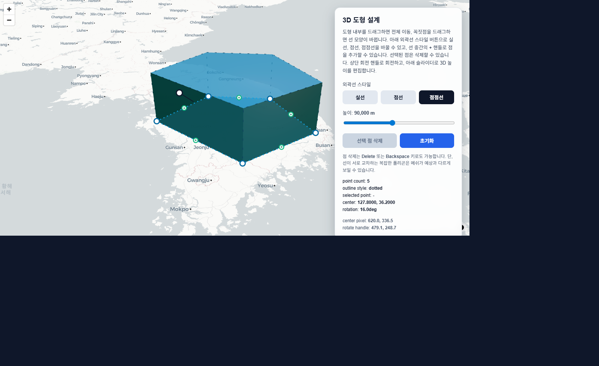

# MaplibreThreeAabb

MapLibre GL JS v4와 Three.js custom layer를 결합해 만든 3D 도형 편집기입니다.

현재 앱은 지도를 바탕으로 임의의 footprint를 직접 편집하고, 그 footprint를 즉시 3D extrusion 메쉬로 다시 생성합니다. 편집용 UI는 SVG 오버레이로 처리하고, 실제 3D 렌더링은 Three.js가 MapLibre의 WebGL 컨텍스트 안에서 담당합니다. 외곽선은 실선, 점선, 점점선 스타일을 선택할 수 있고, 이 스타일은 2D 오버레이와 3D edge 렌더링에 동시에 반영됩니다.

## 스크린샷

아래 이미지는 외곽선 스타일 버튼이 추가된 최신 편집기 화면입니다.



## 핵심 기능

- 다각형 footprint의 꼭짓점 드래그 편집
- 선분 중간 `+` 핸들로 점 추가
- 선택 점 삭제 버튼 및 `Delete` / `Backspace` 삭제
- 도형 전체 드래그 이동
- 상단 회전 핸들로 회전
- 높이 슬라이더로 extrusion 높이 실시간 조절
- 외곽선 스타일 전환: 실선 / 점선 / 점점선
- MapLibre 지도 위 3D custom layer 렌더링
- Electron 개발/패키징 지원

## 사용자 조작 가이드

실제 편집 흐름은 다음 순서로 보면 됩니다.

1. 도형 내부를 드래그하면 footprint 전체가 지도 위에서 이동합니다.
2. 꼭짓점을 드래그하면 외곽선이 바뀌고 3D 메쉬도 즉시 다시 생성됩니다.
3. 각 선분 중간의 `+` 핸들을 누르면 새 점이 추가됩니다.
4. 상단 회전 핸들을 드래그하면 도형이 중심 기준으로 회전합니다.
5. 우측 높이 슬라이더를 움직이면 extrusion 깊이가 실시간으로 바뀝니다.
6. 외곽선 스타일 버튼으로 실선, 점선, 점점선을 전환할 수 있습니다.
7. 점을 선택한 뒤 `Delete` 또는 `Backspace`를 누르거나 삭제 버튼을 누르면 해당 점이 제거됩니다.

추천 확인 순서:

- 먼저 점을 하나 추가해 footprint 형태가 바뀌는지 확인
- 그 다음 회전 핸들로 회전 후 높이 슬라이더로 3D 변화 확인
- 마지막으로 외곽선 스타일 버튼으로 실선, 점선, 점점선 전환 확인

## 실행 방법

의존성 설치:

```sh
npm install
```

웹 개발 서버 실행:

```sh
npm run dev:web
```

웹 프로덕션 빌드:

```sh
npm run build:web
```

Electron 개발 모드:

```sh
npm run dev:electron
```

Electron 패키징:

```sh
npm run package:electron
```

패키징 결과물은 `dist-electron`에 생성됩니다.

## 구현 위치

- `map-aabb/src/app/app.tsx`: 3D 편집기 핵심 구현
- `map-aabb/src/styles.css`: 전체 레이아웃 스타일
- `electron/main.ts`: Electron 메인 프로세스
- `electron/preload.ts`: Electron preload

## 3D 편집기 구조

이 편집기는 크게 두 레이어로 나뉩니다.

1. 편집 레이어
	지도 위에 SVG 오버레이를 띄워 꼭짓점, 선분 중간 핸들, 회전 핸들을 직접 조작합니다.
2. 렌더 레이어
	같은 footprint 데이터를 Three.js `ExtrudeGeometry`로 다시 만들어 MapLibre custom layer에서 3D로 그립니다.

즉, 사용자는 2D 핸들을 조작하지만 내부 데이터는 하나이고, 그 데이터가 곧바로 3D 메쉬와 오버레이 양쪽에 반영됩니다.

## 데이터 모델

편집기의 상태는 두 축으로 나뉩니다.

`ShapeState`

- `centerLng`, `centerLat`: 도형 중심의 지도 좌표
- `rotationZ`: 도형 회전 각도
- `heightMeters`: extrusion 높이

`OutlineStyle`

- `solid`, `dashed`, `dotted` 중 하나
- SVG 외곽선과 Three.js edge material이 같은 값을 공유합니다

`LocalPoint[]`

- footprint를 이루는 점 목록
- 각 점은 도형 중심 기준의 로컬 미터 좌표입니다

이 구조의 장점은 지도 좌표계와 도형 편집 좌표계를 분리할 수 있다는 점입니다. footprint는 항상 로컬 미터 단위로 다루고, 실제 지도 투영은 렌더링 직전에만 수행합니다.

## 좌표 변환 흐름

편집기 구현의 핵심은 로컬 좌표를 지도와 화면 좌표로 일관되게 바꾸는 것입니다.

1. footprint 점은 중심 기준 로컬 미터 좌표로 저장합니다.
2. `rotatePoint()`로 회전 적용 후 MapLibre `MercatorCoordinate` 기준 좌표로 변환합니다.
3. 필요할 때 `projectLocalPoint()`로 화면 픽셀 좌표를 계산합니다.
4. SVG 오버레이와 Three.js 메쉬가 모두 같은 변환 규칙을 공유합니다.

이 역할을 담당하는 주요 함수는 다음과 같습니다.

- `getTransformModelData()`
- `getWorldMercatorForLocalPoint()`
- `projectLocalPoint()`
- `buildOverlayGeometry()`

## SVG 오버레이 편집 방식

사용자가 직접 조작하는 것은 Three 메쉬가 아니라 SVG 오버레이입니다.

오버레이는 다음 요소로 구성됩니다.

- `polygon`: footprint 외곽선과 내부 드래그 영역
- `circle`: 각 꼭짓점 편집 핸들
- `segmentMidpoints`: 각 선분 중간에 생성되는 `+` 핸들
- `rotationHandle`: 회전용 핸들

외곽선 스타일이 바뀌면 SVG path의 `stroke-dasharray`도 함께 바뀝니다. 즉, 이 레이어는 편집 핸들뿐 아니라 사용자가 선택한 외곽선 시각 스타일도 직접 반영합니다.

이 오버레이는 `buildOverlayGeometry()`에서 계산된 화면 좌표를 그대로 사용합니다. 즉, 메쉬와 오버레이가 서로 다른 데이터를 보는 것이 아니라 같은 데이터를 다른 방식으로 시각화합니다.

## 사용자 입력 처리

편집 동작은 `DragState`를 기준으로 나뉩니다.

- `move-shape`: 도형 전체 이동
- `vertex`: 특정 꼭짓점 이동
- `rotate`: 회전

입력 처리 흐름은 다음과 같습니다.

1. `onPointerDown`에서 어떤 핸들을 잡았는지 `DragState`에 기록합니다.
2. 전역 `pointermove` 이벤트에서 현재 포인터를 로컬 미터 좌표로 환산합니다.
3. 상태를 갱신하는 함수로 footprint 또는 shape state를 업데이트합니다.
4. 오버레이와 3D 메쉬를 다시 생성합니다.

관련 함수:

- `getPointerMercator()`
- `getPointerLocalMeters()`
- `startDrag()`
- `updateShapeState()`
- `updateFootprint()`
- `insertVertexAfter()`
- `deleteSelectedVertex()`

## 3D 메쉬 생성 방식

3D는 Three.js `ExtrudeGeometry`를 사용합니다.

1. footprint 배열로 `THREE.Shape`를 만듭니다.
2. `createExtrudedGeometry()`에서 `depth = heightMeters`로 extrusion 합니다.
3. `rebuildShapeGeometry()`에서 기존 메쉬와 엣지를 dispose하고 새 geometry로 교체합니다.
4. 상단 면과 측면은 다른 `MeshStandardMaterial` 색상으로 렌더링합니다.
5. 외곽선 강조를 위해 `EdgesGeometry`를 함께 생성합니다.
6. 외곽선 스타일이 실선이면 `LineBasicMaterial`, 점선/점점선이면 `LineDashedMaterial`을 사용합니다.

이 방식 덕분에 점 추가, 점 삭제, 회전, 높이 변경이 모두 같은 재생성 경로로 처리됩니다.

## MapLibre custom layer 연동

Three.js는 별도 캔버스를 쓰지 않고 MapLibre가 제공하는 WebGL 컨텍스트를 재사용합니다.

구현 흐름:

1. `onAdd()`에서 `THREE.Scene`, `THREE.Camera`, `THREE.WebGLRenderer`, `THREE.Group`를 만듭니다.
2. `render()`에서 MapLibre가 넘겨준 projection matrix에 로컬 mercator transform을 곱합니다.
3. 그 결과를 `camera.projectionMatrix`에 넣고 Three scene을 렌더링합니다.
4. map repaint를 다시 요청해 편집 중 프레임이 끊기지 않게 합니다.

외곽선 스타일 선택은 SVG 오버레이와 Three.js `edges` 객체에 동시에 반영되도록 구현되어 있습니다. 그래서 사용자가 보는 2D 편집 윤곽선과 3D 모델의 edge 표현이 서로 어긋나지 않습니다.

현재 프로젝트는 `maplibre-gl@4.7.1`을 사용합니다. v4 custom layer에서 `render` 시그니처는 `render(gl, matrix, options)`이며, v5의 `defaultProjectionData.mainMatrix` 방식과 다릅니다. 이 차이를 맞춰야 3D 메쉬가 정상적으로 보입니다.

## 상태 갱신 전략

렌더링과 편집이 꼬이지 않도록 React state와 ref를 함께 사용합니다.

- 화면 표시용: `useState`
- 이벤트 핸들러와 custom layer에서 즉시 참조할 최신값: `useRef`

예를 들어 footprint와 shape state는 state와 ref를 동시에 유지하고, 포인터 이동 중에는 ref를 사용해 stale closure 문제를 피합니다.

## 초기값과 리셋

초기 도형은 `initialFootprint`와 `initialShapeState`로 정의되어 있습니다.

- footprint: 5개의 비대칭 점으로 시작
- rotation: `16deg`
- height: `90000m`

`resetEditor()`는 이 초기값으로 되돌리고 지도 카메라도 다시 맞춥니다.

## 현재 제한사항

- 자기 교차(self-intersection) 폴리곤은 extrusion 결과가 예상과 다를 수 있습니다
- 홀(hole) 구조는 아직 지원하지 않습니다
- 스냅, 좌표 직접 입력, 저장/불러오기 기능은 아직 없습니다
- 편집 UI는 SVG 기반이라 고급 편집 툴처럼 제약 조건 편집은 아직 없습니다

## 확장 아이디어

- GeoJSON import/export
- vertex snapping
- hole 편집
- 높이별 색상 규칙
- 다중 도형 레이어
- 선택/편집 히스토리와 undo/redo

## 사용 기술

- React 19
- MapLibre GL JS 4.7.1
- Three.js
- Vite
- Nx
- Electron
